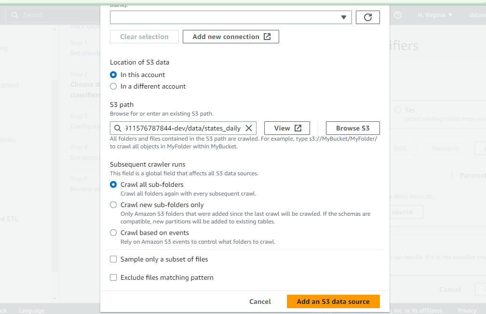

# What is AWS Glue Crawler

AWS Glue Crawler is a fully managed service that discovers and extracts metadata from various data sources. 

It automatically infers schemas, partitions, and data types, and creates a table definition that can be used by AWS Glue ETL jobs. 

AWS Glue Crawler supports a wide variety of data sources, including Amazon S3, Amazon RDS, Amazon DynamoDB, and more.

It is a great choice when you need to automate the discovery and cataloging of your data, and make it accessible for analytics and reporting.

**When to Use AWS Glue Crawler**

* AWS Glue Crawler is a great choice when you need to discover, catalog, and make your data accessible for analytics and reporting. 

* It is particularly useful when you have a large number of data sources and need to keep your metadata up-to-date.

*  AWS Glue Crawler can also be used to prepare data for ETL jobs, such as identifying and resolving schema changes and data quality issues.

# How to Create an AWS Glue Crawler

**Step 1**

* Go to the AWS Glue console.

**Step 2**

* In the left navigation pane, choose Crawlers.

* Click on  `Create crawler`.

* In the Name field, enter a name for your crawler.

> * Note  
You can add a  name of your choice but is recommended to use a name that is identical to the one on the folder you are crawling so that if you notice problems in the future you can easily identify where the problem is

**Step 3 : Add a data Source**

* In the Data source type field, choose the type of data source that you want to crawl.

* Click on Add Data Source   and select the data source of your choice , in this case we are using S3

* On `S3 path` Choose the Folder you want  to crawl

* Under `Subsequent crawler runs` tick on `Crawl all sub-folders`  so that everything inside the folder you have selected will be crawled.

Click on add S3 Data Store   and then Clicck On Next On the page that you have been redirected to.

**Step 4 : Create a new IAM Role**

* Go to the AWS Management Console and open the IAM console

* In the navigation pane of the IAM console, choose Roles, and then choose Create role.

* Click  on create Role 

*  Under `Use cases for other AWS services` look for a service called as shown below  then click on next.

* Select the policy to use for the permissions policy in this case select  `AmazonS3FullAccess`,`AWSGlueConsoleFullAccess`,`AWSGlueServiceRole`   and then click on `Next`

* Choose a name for your role and then click on create role  

* After that you can retun to the crawler configuration and add the new role that you have just configured  as shown below.

* Select a Target Database , if you do not have any Database you can create one very easy by clicking on `Add Database`

* Add a name for your Database and then you click on Create Database

*After that you can select the databse name that you have created above

  
* Click on `Next`  and then  Click on `Create Crawler`

