**What is Real-Time Streaming?**

* Real-time streaming refers to the continuous flow of data from various sources, such as sensors, devices, and applications, to a target destination, such as a database, data warehouse, or dashboard. 

* The data is processed and analyzed in real time, as it is being generated, instead of being stored for later batch processing.

* Real-time streaming allows organizations to respond to events and trends in real-time, enabling them to make data-driven decisions faster.

* In the past, data was often stored in databases and analyzed at a later time. However, with the advent of new technologies, it is now possible to collect and process data in real time.
**Why do we need Real-Time Streaming?**

1. **Faster Decision Making**

* Real-time streaming enables organizations to make fast decisions based on the most current data. This can be critical in industries such as finance, healthcare, and manufacturing, where timely decisions can mean the difference between success and failure.

2. **Improved Customer Experience**

* Real-time streaming can help organizations provide a better customer experience by enabling them to respond to customer needs and preferences in real-time.

3. **Fraud Detection**

* Real-time streaming can be used for fraud detection, where fraudulent transactions can be identified and stopped in real-time before any damage is done.

4. **Predictive Maintenance**

* Real-time streaming can be used for predictive maintenance, where sensors on equipment can detect anomalies in real-time, and maintenance can be scheduled before the equipment fails.

5. **Improve customer service**

* Real-time streaming can be used to improve customer service by providing businesses with insights into customer behavior. For example, a retailer could use real-time streaming to track customer browsing behavior and identify products that customers are interested in.


**Real-life examples of real-time streaming**

Real-time streaming is not necessary for every use case. It is best suited for situations where real-time processing and analysis of data are critical. Some common use cases for real-time streaming include  the following points


1. **Stock Market Analysis**

*  Real-time streaming can be used for stock market analysis, where traders need to make fast decisions based on real-time market data.


2. **Social Media Monitoring**

* Real-time streaming can be used for social media monitoring, where organizations need to track mentions of their brand or products in real-time.

3. **Traffic Management**

*  Real-time streaming can be used for traffic management, where data from sensors and cameras can be used to optimize traffic flow in real-time.


4. **E-commerce**

* Real-time streaming can be used for e-commerce, where real-time analysis of customer behavior can be used to personalize recommendations and promotions.

5. **IoT applications**

* Real-time streaming is used in many IoT applications, such as smart homes and self-driving cars.


**Real-Time Streaming with Apache Kafka**

* Apache Kafka is a distributed streaming platform that is used to build real-time data pipelines and streaming applications.

*  It is designed to handle large amounts of data in real-time, making it a popular choice for data engineers and architects.

> It was originally developed by LinkedIn and later released as an open-source project under the Apache Software Foundation.


**Why do we need Apache Kafka?**

1. **Scalability**

* Apache Kafka is highly scalable and can handle large amounts of data in real-time. It can be used to build data pipelines that can scale to handle billions of events per day.

2. **Real-Time Processing**

* Apache Kafka enables real-time processing of data, making it possible to respond to events and trends as they happen.

3. **Fault-Tolerant**

* Apache Kafka is fault-tolerant and can tolerate node failures without losing data.

**When should we use Apache Kafka?**

Apache Kafka is best suited for situations where real-time processing and analysis of data are critical.

**Examples**

1. **Log Aggregation**

* Apache Kafka can be used for log aggregation, where logs from multiple systems are collected and processed in real-time.

2. **Stream Processing**

* Apache Kafka can be used for stream processing, where data is processed in real-time as it is being generated.

3. **Messaging**

* Apache Kafka can be used as a messaging system, where messages are exchanged between systems and applications in real-time.

4. **Event Sourcing**

* Apache Kafka can be used for event sourcing, where events are stored in Kafka and processed in real-time to generate a current state.


**Components of Apache Kafka**

Apache Kafka has three main components: producers, brokers, and consumers.

1. **Producers**

* Producers are responsible for producing data to Kafka. 

* They can be applications ,sensors, systems that generate data and send it to Kafka.


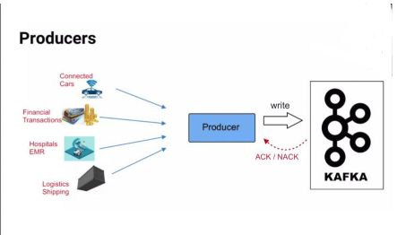 


2. **Brokers**

* Brokers are responsible for storing data in Kafka. 

* They are the servers that run Kafka and store data in topics.


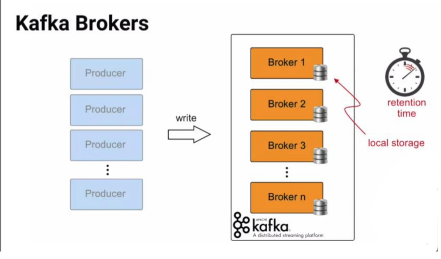 


3. **Consumers**

* Consumers are responsible for consuming data from Kafka. 

* They can be applications or systems that read data from Kafka and process it.


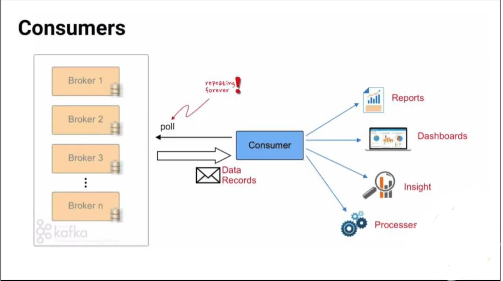 


**Architecture of Apache Kafka**

* Apache Kafka has a distributed architecture that consists of multiple brokers that run in a cluster. 

* The brokers store data in topics, which are divided into partitions. 

* Each partition is replicated across multiple brokers for fault-tolerance. 

* To manage the cluster, Apache Kafka uses ZooKeeper, which is a distributed coordination service.

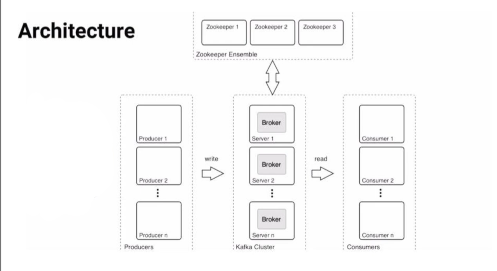 


1. **Topics**

* Topics are the fundamental unit of data organization in Apache Kafka.

* They are logical categories or streams of data that are stored in Kafka. 

* Producers write data to topics, while consumers read data from topics.


2. **Partitions**

* Topics are divided into partitions, which are the basic unit of parallelism in Apache Kafka. 

* Each partition is an ordered, immutable sequence of records that can be stored on a single broker or replicated across multiple brokers.

3. **Segments**

*  Each partition is further divided into segments, which are a sequence of records stored in a log file.

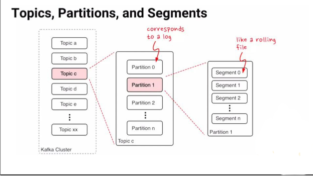 

4. **Log Files**

* The log file is the basic storage unit in Kafka.

* When a log file reaches a certain size, it is closed and a new log file is created.

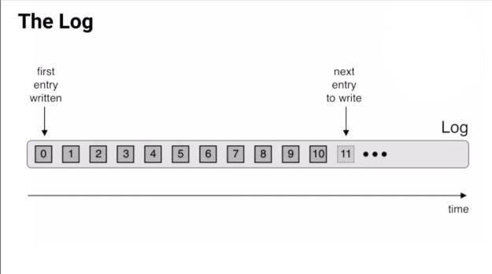 

5. **ZooKeeper**

* ZooKeeper is a distributed coordination service that is used to manage the Apache Kafka cluster.

* It helps manage the brokers in the cluster, keep track of the topics and partitions, and handle failover.


**Broker replication**

*  Broker replication means that each broker in the cluster maintains a copy of the data that is stored in other brokers, providing redundancy and ensuring that the cluster can continue to operate even if one or more brokers fail.

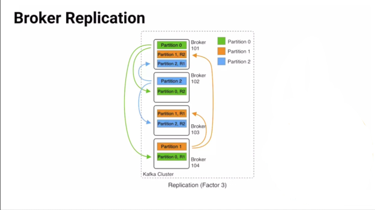) 


**Creating an EC2 instance for Kafka**

**Step 1 : Go to the AWS console and log in to your account.**

* To create an EC2 instance, you must first log in to the AWS console. If you don't have an AWS account yet, you can create one for free.

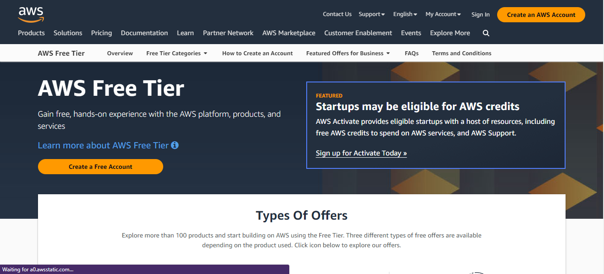

To create your free tier account click [Here](https://aws.amazon.com/free/?all-free-tier.sort-by=item.additionalFields.SortRank&all-free-tier.sort-order=asc&awsf.Free%20Tier%20Types=*all&awsf.Free%20Tier%20Categories=*all)

**Step 2: Navigate to EC2**

* Once you're logged in to the AWS console, navigate to the EC2 dashboard by clicking on the Launch a virtual machine link .

**Step 3: Launch an Instance**

Click the "Launch Instance" button to launch a new EC2 instance.

Add a name of your choice for your new instance as shown below.

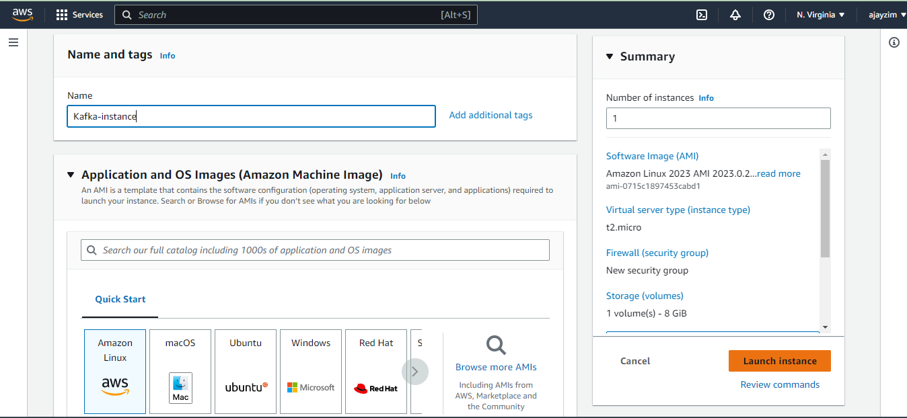

Step 4: Choose an Instance Type

In this step, you can choose the instance type that best suits your needs based on the CPU, memory, and storage requirements of your application.

ChOose lINUX for Amazon Web  services

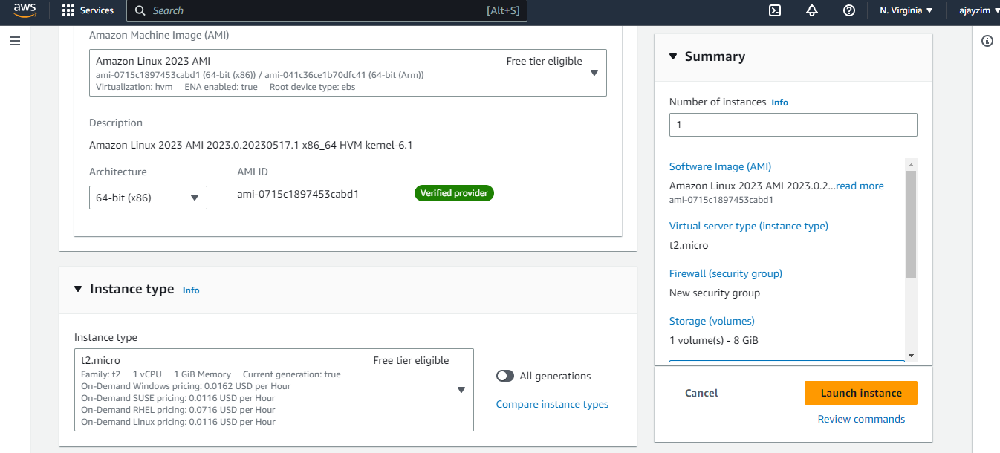


**Step 5: Create a Key Pair**

A Key pair is a set of security credentials used to authenticate a user's access to an EC2 instance.

* Under the Key Pair heading, click Create  new Key Pair.

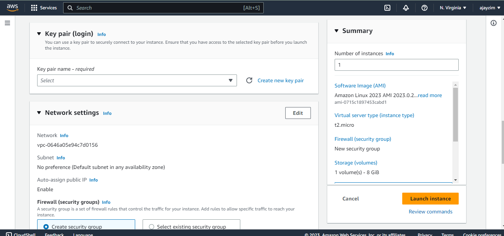

* In the "Create Key Pair" dialog box, enter a name for your new key pair in the Key pair name field. This name should be unique and easy to remember.

* Click Create  key pair.

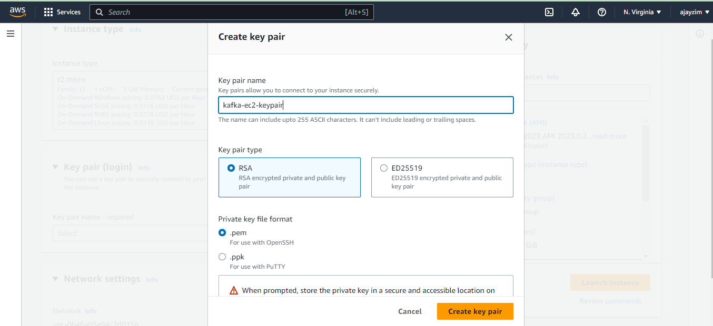

> The console will download a .pem file containing your private key. Save this file in a safe place.(your current working directory)

**Connecting to an EC2 instance**

There are two ways to connect to an EC2 instance:

* Using SSH

* Using EC2 Instance Connect
In this tutorial we are going to use  SSH

To use SSH, you will need to:

* Go to the Instances page, select the instance that you want to connect to and Click Connect.


* On the ```Connect To Your Instance``` page, choose SSH Client and copy the ssh command and paste it in the cmd

> * make sure you are in the folder that you saved your ```.pem file containing your private key```

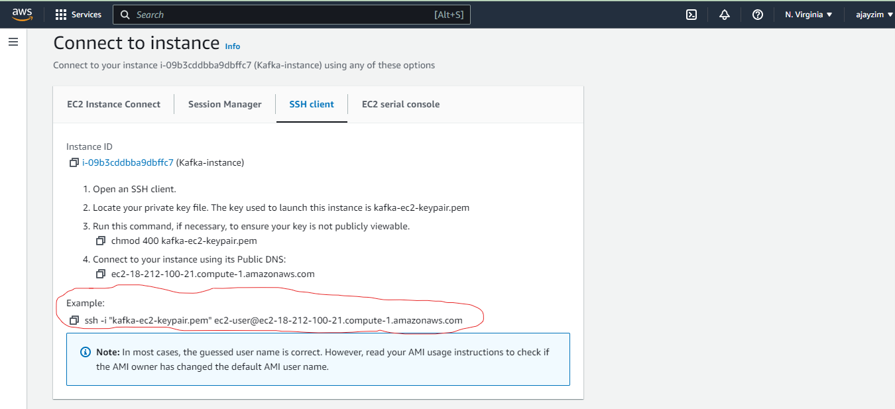


* Use the ssh command to connect to your EC2 instance.

* The syntax for the ssh command is:

```
ssh -i <key_file> <user>@<instance_ip_address> 
```

**Explanation**

```ssh``` : This is the command to initiate an SSH connection to a remote host.

```-i  twitter_ec2_key.pem``` : This option specifies the private key file to use for authentication. In this case, the private key file is twitter_ec2_key.pem.

```ubuntu``` : This is the username to use for the SSH connection. In this case, the username is ubuntu.

```ec2-user@ec2-18-212-100-21.compute-1.amazonaws.com```: This is the hostname or IP address of the remote machine to connect to. In this case, the hostname is ec2-user@ec2-18-212-100-21.compute-1.amazonaws.com

This SSH command is connecting to a remote EC2 instance with the IP address of ```ec2-18-212-100-21.```compute-1.amazonaws.com" using the "ubuntu" username and the private key file ```twitter_ec2_key.pem``` for authentication.

Once you are connected to your EC2 instance, you will be able to run commands on the instance.If your cmd writes the as shown below then you have successfully connected to your ec2 instance.

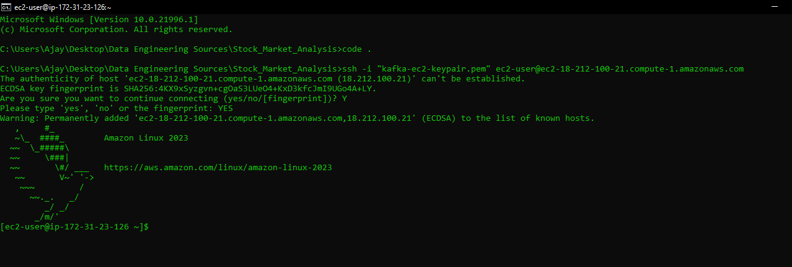


**Installing Apache Kafka onto our EC2 machine**

**Step 1: Download and Extract Kafka**

You need to download Kafka. You can download the latest version of Kafka from the Apache Kafka website. To download Kafka, use the following command:

``` 
wget https://downloads.apache.org/kafka/3.4.0/kafka-3.4.0-src.tgz 
```

After downloading Kafka, extract it using the following command:

```
tar -xzf kafka-3.4.0-src.tgz
```

**Step 2: Install Java**

Kafka requires Java to run, so you need to install JDK 8 or later on your Amazon Linux EC2 instance. To do so, run the following command:

```
sudo yum install java

java -version
```


**Step 3: Start Zookeeper**

To start, we need to configure and start Zookeeper.

 Zookeeper is a centralized service for managing configuration information, naming, providing distributed synchronization, and providing group services. 

 ```python
 cd kafka-3.4.0-src

 bin/zookeeper-server-start.sh config/zookeeper.properties
```


**Step  4  : Start theKafka Server**

In a new terminal window, navigate to the Kafka directory and run the following command:

``` 

```