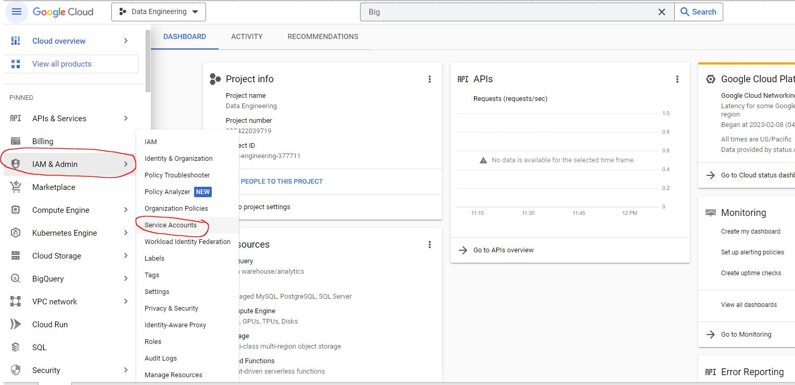
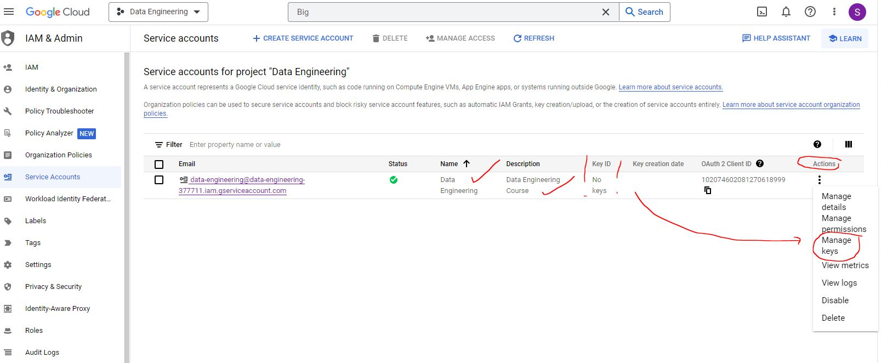
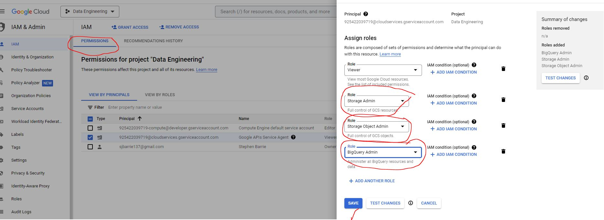

#  What is Terraform?

Terraform is an open-source infrastructure as code (IaC) tool that allows you to define and manage your infrastructure in a declarative manner. 

With Terraform, you write code that describes the desired state of your infrastructure, and Terraform takes care of provisioning and managing the underlying resources to ensure that the actual state matches the desired state.

 **Example**

Let's say you want to create a new database instance in the cloud. 

With Terraform, you would define the configuration for the database instance in a Terraform file, specifying details such as the database engine, instance size, and storage capacity. 

You would also define any necessary dependencies, such as a VPC or security group. Once you've written the configuration, you can use Terraform to apply it, and Terraform will automatically create the necessary resources in the cloud.


#  Benefits of using Terraform

* It makes infrastructure management more efficient and less error-prone. By defining your infrastructure as code, you can version control your infrastructure changes, and you can easily reproduce your infrastructure in different environments. You can also use Terraform to manage complex dependencies between resources, ensuring that your infrastructure is always consistent and up to date.

* Terraform manageS your data storage and processing infrastructure, such as databases, data lakes, and compute clusters. 


# Who is using Terraform?

* DevOps engineers

* System administrators

* Data engineers.


# When should you use Terraform?

* When you need to manage large and complex infrastructure environments that are difficult to manage manually.

* When you need to ensure that your infrastructure is always up to date and consistent across different environments.

* When you need to manage infrastructure changes in a predictable and reproducible way.

* When you need to collaborate with other teams and stakeholders on infrastructure changes, and you need a version-controlled and auditable way to manage those changes.

**Installing Terraform in GCP**

# Creating a Service Account in GCP

A service account is a special type of account used by applications and services to access Google Cloud resources. 

Service accounts are recommended for use with applications and services, rather than using individual user accounts. In this blog post, we'll walk you through the steps for creating a service account in Google Cloud.


**Step 1: Go to the IAM & Admin page**

The first step is to go to the IAM & Admin page in the Google Cloud Console.

**Step 2: Create a new service account**

Once you're on the IAM & Admin page, click on "Service accounts" in the left-hand menu, and then click on the "Create Service Account" button. You'll be prompted to enter a name and description for your new service account.




**Step 3: Configure service account permissions**

* After you've created your service account, you'll need to configure its permissions. 

* Click on your new service account in the list of service accounts, and then click on "Add Key" to create a new key for the service account. 

* You can choose either a JSON or P12 key file format depending on your needs.





The json file will be downloaded to your default downloads folder.

> * Make sure to keep this key file secure, as it provides access to your Google Cloud resources.


**Step 3: Download and install the Google SDK**


* Google SDK (Software Development Kit) is a collection of software development tools and libraries that enable developers to create applications that interact with Google Cloud Platform (GCP) services.

* The SDK provides a set of APIs and command-line tools that allow developers to build, test, and deploy applications on GCP.

* The Google SDK consists of various components, such as Cloud SDK, App Engine SDK, and Firebase SDK, each of which provides tools for specific GCP services.


To downlaod Go to the [Google Cloud website](https://cloud.google.com/sdk).

To check if we have it installed we can run the following prompt at the command line :

```python 
gcloud -v
```


Now we need to export our key credentials from the json file at the command line:

```
export GOOGLE_APPLICATION_CREDENTIALS=$(pwd)/<json_file_name>.json
```
Finally, refresh token/session, and verify authentication:

```
gcloud auth application-default login
```
Then need to login from the browser to Google account once again and Allow and then copy verification code to terminal:


We are now going to set up the following infrastructures within Google Cloud Platform (GCP):

1. **Google Cloud Storage (GCS)**

* A  bucket in GCP environment where you can store files) Data Lake - raw data in organised 

* GCS stores data in objects, which consist of data and metadata. 

* Objects can be up to 5 TB in size and can be stored in buckets, which are logical containers for objects. 

* GCS buckets can be located in different regions or multi-regions to optimize data access and availability.

fashion 

2. **Big Query: Data Warehouse**

* BigQuery is a cloud-based data warehouse and analytics platform provided by Google Cloud Platform (GCP) that allows users to store and analyze large amounts of data using a serverless, highly scalable architecture. 

* It can handle petabyte-scale datasets and provides fast, interactive SQL-like queries. 


# Permissions for the Big Query  and Google Cloud Storage (GCS)

We need to grant two additional service permissions:

* Storage Admin (the bucket itself) and Storage Object Admin (the objects within the bucket)

* BigQuery Admin




> * Note <br>
The permissions selected above are Prebuilt but ,Under Production enviroment we have to create out own custom Permision

**We still require to enable the APIs:**

The local enviroment require api for them to communicate with the cloud.

```
https://console.cloud.google.com/apis/library/iam.googleapis.com

https://console.cloud.google.com/apis/library/iamcredentials.googleapis.com

```

# Creating GCP Infrastructure with Terraform

**Write configuration**

* The set of files used to describe infrastructure in Terraform is known as a Terraform configuration. You will now write your first configuration to create a network.

* Each Terraform configuration must be in its own working directory. Create a directory for your configuration.


```bash
mkdir Terraform
```

Change into the directory.

```bash
cd Terraform
```

Terraform loads all files ending in `.tf` or `.tf.json` in the working directory. Create a `main.tf` file for your configuration.

```bash
touch main.tf

touch variables.tf
```

Open `main.tf` in your text editor, and paste in the configuration below. Be sure to replace `<NAME>` with the path to the service account key file you downloaded and `<PROJECT_ID>` with your project's ID, and save the file.

```bash

'''Terraform configuration block. Here, we define the required version of Terraform, the backend where we want to store the Terraform state file'''

terraform {
  required_version = ">= 1.0"
  backend "local" {}  # Can change from "local" to "gcs" (for google) or "s3" (for aws), if you would like to preserve your tf-state online
  required_providers {
    google = {
      source  = "hashicorp/google"
    }
  }
}


provider "google" {
  project = var.project
  region = var.region
  // credentials = file(var.credentials)  # Use this if you do not want to set env-var GOOGLE_APPLICATION_CREDENTIALS
}

# Data Lake Bucket
# Ref: https://registry.terraform.io/providers/hashicorp/google/latest/docs/resources/storage_bucket
resource "google_storage_bucket" "data-lake-bucket" {
  name          = "${local.data_lake_bucket}_${var.project}" # Concatenating DL bucket & Project name for unique naming
  location      = var.region

  # Optional, but recommended settings:
  storage_class = var.storage_class
  uniform_bucket_level_access = true

  versioning {
    enabled     = true
  }

      lifecycle_rule {
    action {
      type = "Delete"
    }
    condition {
      age = 30  // days
    }
  }

  force_destroy = true
}

# DWH
# Ref: https://registry.terraform.io/providers/hashicorp/google/latest/docs/resources/bigquery_dataset
resource "google_bigquery_dataset" "dataset" {
  dataset_id = var.BQ_DATASET
  project    = var.project
  location   = var.region
  ```

**Adding Variables**

Open `variables.tf` in your text editor, and paste in the configuration below

```bash
locals {
  data_lake_bucket = "us_accidents_data_lake"
}

variable "project" {
  description = "github-archive-de"
}

variable "region" {
  description = "Region for GCP resources. Choose as per your location: https://cloud.google.com/about/locations"
  default = "europe-west6"
  type = string
}

variable "storage_class" {
  description = "Storage class type for your bucket. Check official docs for more info."
  default = "STANDARD"
}

variable "BQ_DATASET" {
  description = "BigQuery Dataset that raw data (from GCS) will be written to"
  type = string
  default = "us_accidents_data_all"

```

for more information you can visit the Terraform  Documentation [here](https://developer.hashicorp.com/terraform/tutorials/gcp-get-started/google-cloud-platform-build)


Once we have configured the above Terraform files, there are only a few execution commands which makes it very convenient to work with.


1. **Initializing & configuring the backend**

* The command below Initializes & configures the backend, installs plugins/providers, & checks out an existing configuration from a version control

```
terraform init
```

2. **Preview local changes**

* The command below Matches/previews local changes against a remote state, and proposes an Execution Plan.

```
terraform plan
```

3. **Asking for approval**

* The command below Asks for approval to the proposed plan, and applies changes to cloud

```
terraform apply
```

4. **Removes your stack from the Cloud**

```
terraform destroy
```

**Step 4: Setup of Kaggle API**]

1. Create a Kaggle free account

2. Create an API token:
    *   Click on your avatar

    * Go to Account menu

    * Click on the option "Create New API Token"

    * Download the json file for local setup

3. In your local setup, copy the file into the path:

```
~/.kaggle/
```

**How to copy the fule into ~/.kaggle/**

a. Open a terminal window on your local machine.

b. Navigate to your home directory using the cd command. You can do this by running:

```
cd ~
```
c. Create the ~/.kaggle/ directory using the mkdir command. You can do this by running:
```
mkdir ~/.kaggle
```

d. Copy the kaggle.json file to the ~/.kaggle/ directory using the cp command. You can do this by running:

```
cp kaggle.json ~/.kaggle/
```

By following these steps, you should be able to copy the kaggle.json file to the ~/.kaggle/ directory on your local machine.


> * Note <br>
For your security, ensure that other users of your computer do not have read access to your credentials:

```
chmod 600 ~/.kaggle/kaggle.json
```


