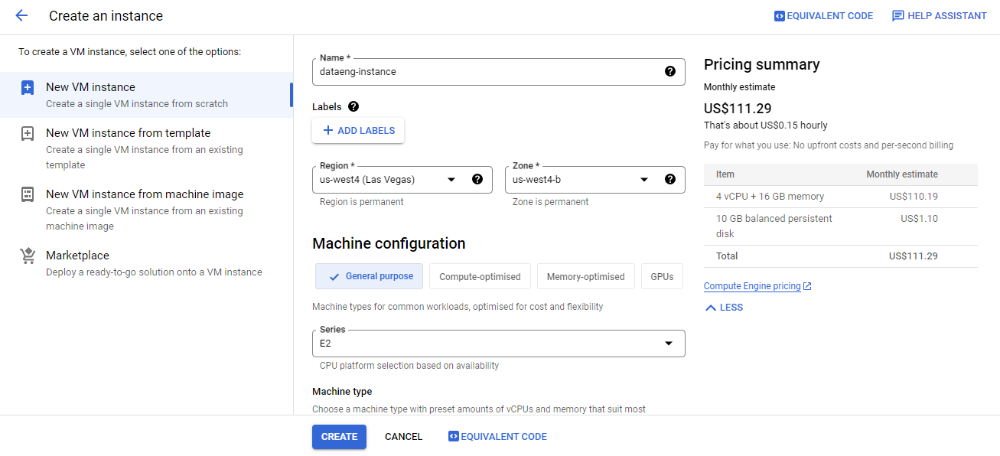
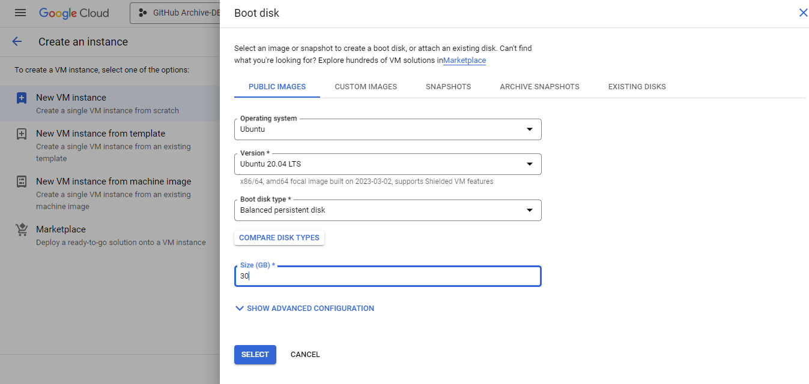
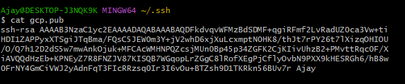
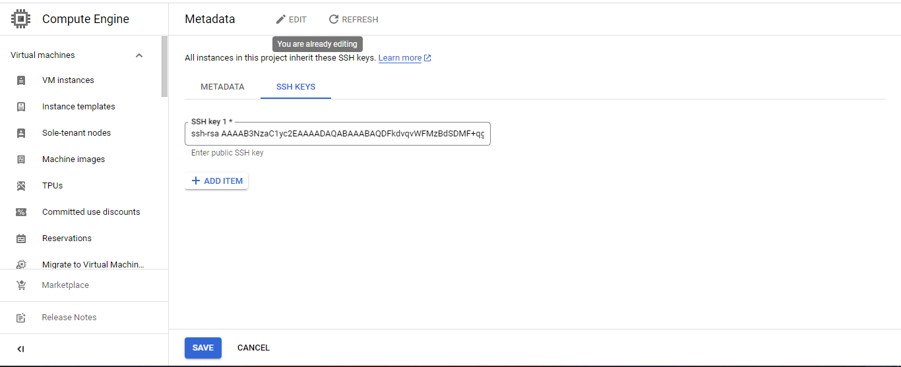
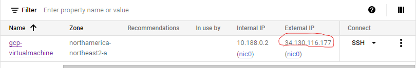
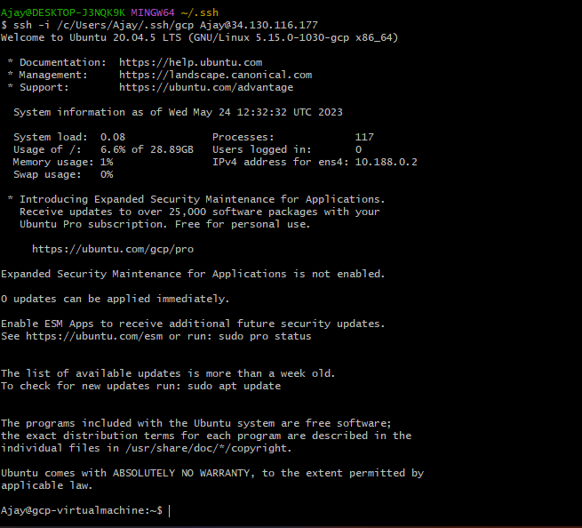

# **Setting up a Virtual Machine in Google Cloud Platform**

A Google Virtual Machine (VM) is a computer that runs on Google Cloud Platform. VMs are isolated from each other and can be customized to meet your specific needs. They are a great way to run data science projects, as they offer a number of advantages over traditional on-premises servers.

**Advantages of using Google VMs for data science:**

1. Scalability: VMs can be scaled up or down as needed, which makes them ideal for projects with fluctuating workloads.

2. Cost-effectiveness: VMs are a cost-effective way to run data science projects, as you only pay for the resources that you use.

3. Flexibility: VMs can be customized to meet your specific needs, which gives you a lot of flexibility in how you run your projects.

**Big tech companies that are using Google VMs for data science:**

* Netflix
* Spotify
* Airbnb
* Uber

These companies are using VMs to run a variety of data science projects, including machine learning, natural language processing, and image recognition. VMs are a powerful tool that can help you to accelerate your data science projects.

**Steps on how to configure a Google VM:**

1. **Go to the Google Cloud Platform Console.**

> a.) Click the Compute Engine tab.


> b.)  Click the Create Instance button.


> c . In the Name field, enter a name for your instance.


> d. In the Machine type drop-down list, select the machine type for your instance.

> e. In the Region drop-down list, select the region for your instance.

> f. In the Zone drop-down list, select the zone for your instance.



> g.Next, change the boot disk with the following configurations:



*Click the Create button.*

Your instance will be created and will be ready to use in a few minutes.

Once your instance is created, you can connect to it using SSH. 

**SSH keys**

* SSH keys are a secure way to authenticate to your VMs. 

* They allow you to connect to your VMs without having to enter a password. GCP makes it easy to create and manage SSH key

**Adding an SSH Key**

- To add an SSH key to your VM, you will need to create an SSH key pair. You can do this using the following steps:


 **Configure SSH Keys**

> Generate a new SSH key with the following commands:

```bash

cd ~/.ssh

ssh-keygen -t rsa -f <key-file-name> -C <username> -b 2048
```

What does this mean ?

1.  The command ```cd ~/.ssh``` changes the current directory to the .ssh directory in the user's home directory. The tilde ```~```character is a shorthand way of referring to the user's home directory.

2. The command ```ssh-keygen -t rsa -f <key-file-name> -C <username> -b 2048``` is used to generate a new SSH key pair

* ```-t rsa```: Specifies the type of key to generate. In this case, it's an RSA key.

* ```-f <key-file-name>```: Specifies the filename to use for the key. The <key-file-name> is the name you choose for the private and public key files. If you don't specify a file name, the default name id_rsa will be used.

* ```-C <username>```: Specifies a comment to add to the key. The <username> is an optional comment field that can be used to help identify the key's purpose or owner.

* ```-b 2048```: Specifies the number of bits in the key. The -b option indicates the key size in bits. In this case, it's 2048 bits which isconsidered a good balance between security and performance.

The above commands will raise a prompt to ```enter``` a passphrase. You can leave it and press enter. If it asks for confirmation, press ```enter``` again. Here's an example:


This generates 2 files in the .ssh folder, one for the public ```(gcp.pub)```  and one for the private key ```(gcp)```.


**Uploading the public Key to Gcp**

* Open the ```gcp.pub``` file and copy its contents. Or you can use the cat command to display the contents in the terminal.

```bash
cat gcp.pub
```




3. **Go to the GCP Console**

* Click on Compute Engine > Settings > Metadata.

* Click on SSH Keys > Add SSH Keys

* Paste the contents of the public key that you copied previously on the text box and click Save.




Now, you can connect to your Google VMs using the following command:

```bash

ssh -i <PATH_TO_PRIVATE_KEY> <USERNAME>@<EXTERNAL_IP>

```

### What does this mean ?

> The command ssh -i <PATH_TO_PRIVATE_KEY> <USERNAME>@<EXTERNAL_IP> is used to connect to a remote server using SSH protocol by specifying the path to a private key file for authentication. 

Here's a breakdown of the components of the command:

> * ssh: This is the command to initiate an SSH connection.

> * -i <PATH_TO_PRIVATE_KEY>: This option specifies the path to the private key file to use for authentication. The PATH_TO_PRIVATE_KEY is the file path to the private key file that was generated using ssh-keygen. This key should be kept securely on your local machine.

> * <USERNAME>@<EXTERNAL_IP>: This is the username and IP address of the remote machine you want to connect to. <USERNAME> is the username you will use to log in to the remote machine, and <EXTERNAL_IP> is the IP address of the remote machine.




The code above will spin up a virtual machine instance for you.

Here's an example on my system:




If you want to connect to a VM using any other options, please go through the official documentation on [Connecting to VMs](https://cloud.google.com/compute/docs/connect/standard-ssh).


**Best Practices for Using VMs and SSH Keys**

Here are some best practices for using VMs and SSH keys in a secure way:

* Use strong passwords for your VMs.

* Use a separate password for each VM.

* Enable two-factor authentication for your VMs.

* Keep your VMs up to date with the latest security patches.

* Use SSH keys to authenticate to your VMs.

* Do not share your SSH keys with anyone.

* Store your SSH keys in a safe place.

By following these best practices, you can help to keep your VMs and data secure.


